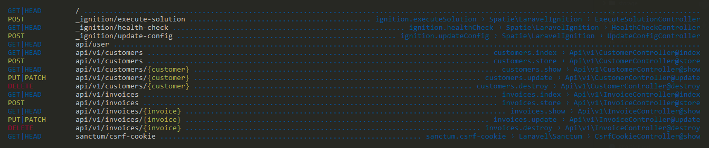

##### ENLACE DEL VIDEO #####
>https://youtu.be/YGqCZjdgJJk

## f86d67e  Versioning and Defining Routes
Al utilizar prefijos definidos como en el siguiente ejemplo:

>Route::group(['prefix' => 'v1', 'namespace' => 'App\Http\Controllers\Api\v1'], function () {
    Route::apiResource('customers', CustomerController::class);
    Route::apiResource('invoices', InvoiceController::class);
});

Estamos creando de forma versatil las rutas en relacion a la versión que usaremos:

## Transforming Database Data Into JSON
- Lo siguiente que haremos es cambiar el tipo de formato de los atributos a camelcase, ya que es la convención en JSON, y cualquiera que use mi API esperará camelcase.

RECURSOS DE ELOQUENT : https://laravel.com/docs/10.x/eloquent-resources#introduction

Las clases de recursos de Eloquent le permiten transformar expresiva y fácilmente sus modelos y colecciones de modelos en JSON.
> php artisan make:resource v1\CustomerResource